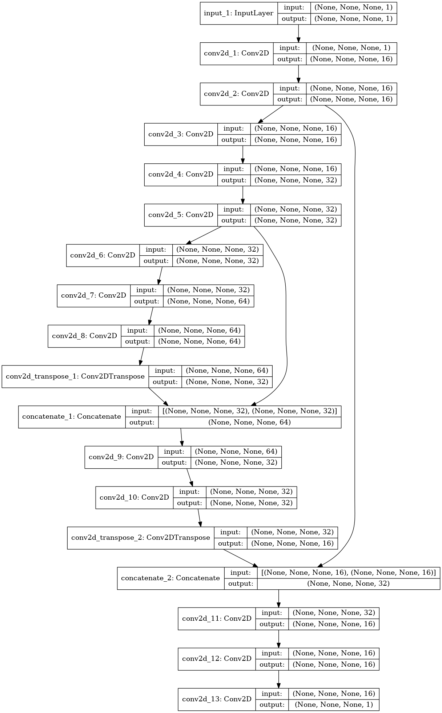
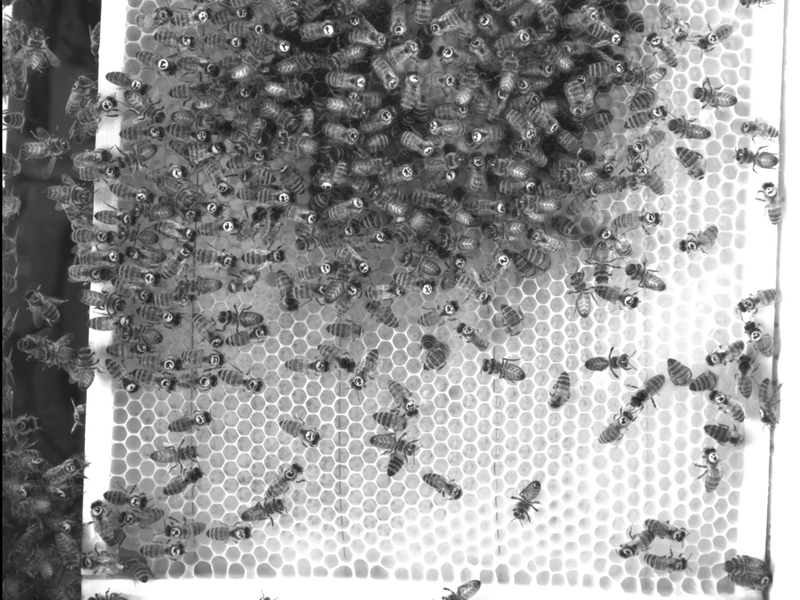
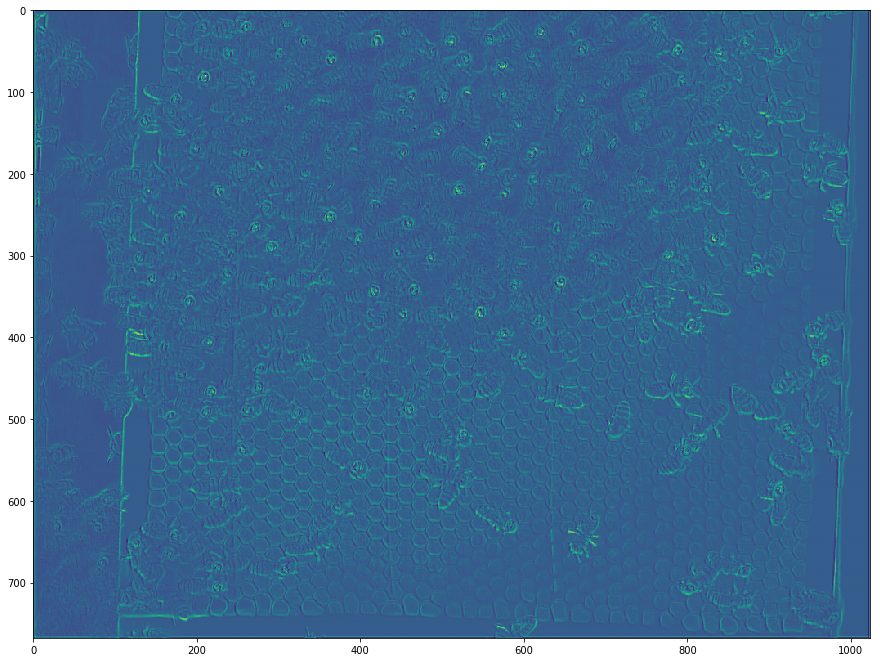

# BeeTrack
This is a work in progress. We are trying to track bees with CNNs.

Currently, we are unsure if we want to track physically unmarked bees or not. We think we will try the first, because it is a harder problem.

The problem with that is we literally don't have a dataset. We are labeling bees on our own. It is estimated to take +5 minutes per image (according to Mr. Ho)

Originally, we were going through the process of implementing this model:

Now we are using Ternaus.

# Getting Started
* [demo.ipynb](samples/demo.ipynb) This code clones the Ternaus Net repo and run an image such as this one:

Running the code is simple:
1) Use pip or anaconda with the requirements.txt to install requirements.
2) Run the demo.ipynb
(Open/run the jupyter notebook.)

Here is an output:

