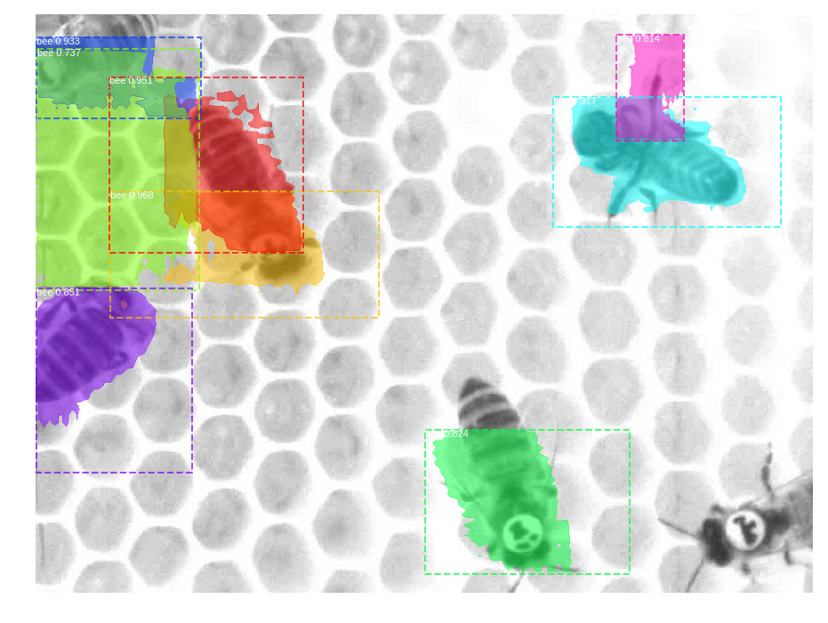
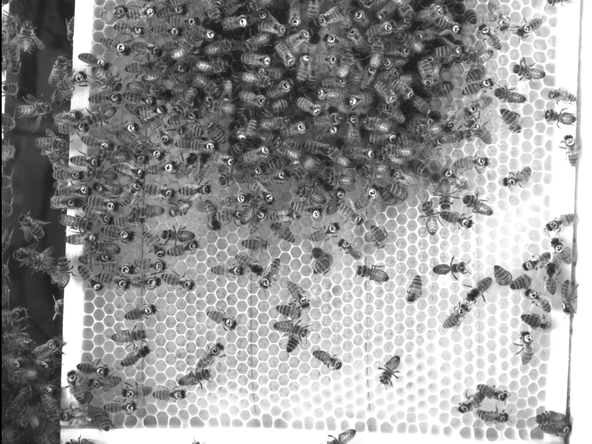

# BeeTrack
This is a work in progress. We are trying to track bees with CNNs.

Here are the weights for epoch 180.

https://drive.google.com/open?id=167kpM5VTyNSJoeaRiNRPEmNfMq--36hj

We tried to track both physically unmarked and marked bees.

The problem with that is we literally don't have a dataset. However, we are gratefull for the bee videos sent to us from the Biorobotics Lab at the Free University of Berlin. Here are the videos:

https://drive.google.com/drive/folders/1Mx3yAJn2YVNs1iivuREKL6HTq9hkssqH

https://github.com/BioroboticsLab/

Originally, we were going through the process of implementing this model:

Then we were going to use TernausNet.

Now we are using Mask RCNN.

# Getting Started
* [demo.ipynb](demo.ipynb) This code clones the Ternaus Net repo and run an image such as this one:

Running the code is simple:
1) Use pip or anaconda with the requirements.txt to install requirements.
2) Run the demo.ipynb
(Open/run the jupyter notebook.)
